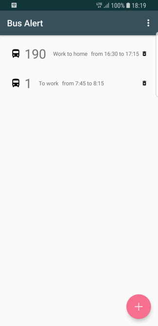
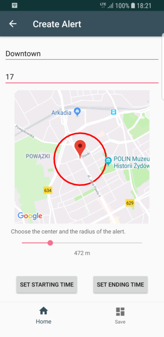

# BusAlert
Android app showing custom alerts based on live :bus: and :tram: data for Warsaw.

### Features

* Add alerts which fire based upon customizable attriibutes (bus/tram line, location, time of day)
* View created alerts in a list or on a map
* Display live bus and tram positions on a map

### TODOs

* Improve the UI design
* Allow to choose which lines to display on the map
* Improve the accuracy of the alerts
